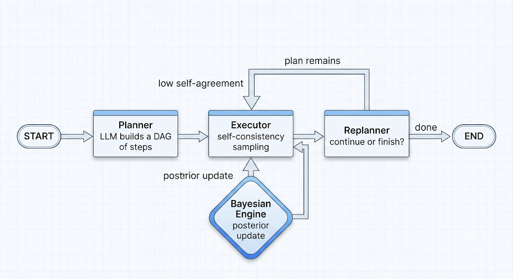
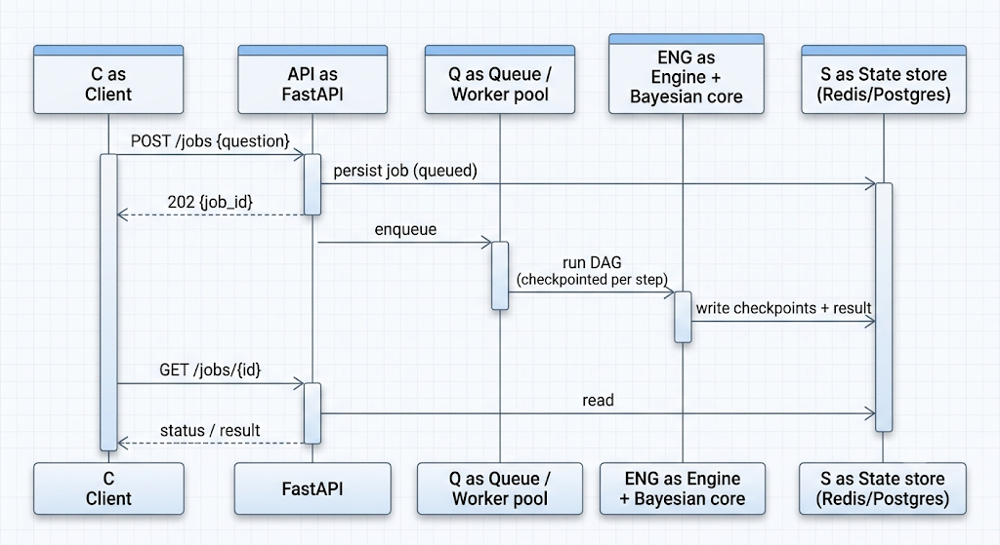

# Bayes Execution Engine

A **Plan-and-Execute** agent (LangGraph) with a **conjugate Bayesian conflict resolver**,
served behind an **async API**, running entirely on a **local LLM** via
[llama.cpp](https://github.com/ggml-org/llama.cpp).

Standard agents "guess again" on conflicting data and loop or hallucinate. This engine
decouples *planning* from *doing*, and gates each step's confidence on a **real Bayesian
update** driven by how consistently the model answers, calibrated uncertainty, not a vibe.

---

## Architecture

A LangGraph `StateGraph`: a shared `PlanExecuteState` flows Planner → Executor →
Replanner; the executor calls the Bayesian engine when a step is uncertain.



For long-running prompts an async API decouples the work so HTTP requests never time out
(`POST /jobs` → poll `GET /jobs/{id}`). In-repo that's a `ThreadPoolExecutor`; the same
contract maps to a Kafka/RabbitMQ + Celery deployment — see
[docs/SYSTEM_DESIGN.md](docs/SYSTEM_DESIGN.md).



---

## Execution model: self-consistency → real evidence

The executor runs each step by **sampling the model N times** (temp > 0) and measuring how
much the samples agree (self-consistency, Wang et al. 2022). From that it derives three
ordinal signals — `DataQuality` (agreement), `TaskStatus` (answerability), `ToolReliability`
(answer dispersion) — and feeds them to the Bayesian engine. The medoid (consensus) answer
flows on; the agreement drives confidence. So conflicts fire on **genuine model
uncertainty**, not keywords. No model? It falls back to a deterministic mock. Detail:
[docs/EXECUTION_MODEL.md](docs/EXECUTION_MODEL.md).

```bash
python demo.py --sim     # no model needed; shows the mechanism
```
```
CONFIDENT  "capital of France?"           self-consistency 1.00  CONFIDENCE 0.72  (CERTAIN)
AMBIGUOUS  "Bitcoin price next Tuesday?"  self-consistency 0.15  CONFIDENCE 0.34  (conflict)
```

---

## What you can ask it

Answers come from the **local model's own knowledge** (no web, no private data). Best fits:
explanations, comparisons, and decomposable multi-step reasoning (e.g. *"Explain how RSA
works and why it's secure"*). The point to demo is the **confidence contrast**: solid topics
score high; obscure/ambiguous ones scatter and confidence drops. Poor fits (by design):
real-time info, private data, hard trivia/math — self-consistency correctly reports low
confidence there.

---

## The Bayesian core

For each of the `5×5×5 = 125` signal contexts, `P(Outcome | context)` is **Categorical**;
its conjugate prior is the **Dirichlet** — that's the whole reason it's the right tool:

- **Conjugacy** ⇒ posterior in closed form, `α_post = α_prior + counts`. O(1) online updates,
  reproducible, no sampling.
- Lives on the **simplex** ⇒ every predictive column is a valid distribution by construction.
- `α₀ = Σα` **is** the effective sample size ⇒ free **credible intervals** that shrink with data.

```python
resolve_conflict({"TaskStatus": 4, "DataQuality": 4, "ToolReliability": 4})
# {"state": "AMBIGUOUS", "confidence": 0.43,
#  "credible_interval": [0.18, 0.69], "effective_sample_size": 13.0, ...}
```

**Why 125?** Not "optimal" — it's `5³` (three signals × five ordinal levels), a granularity
choice: too coarse can't separate "uncertain" from "contradictory"; too fine leaves each
cell unvisited (curse of dimensionality). Richer input is handled by reducing dimensions,
not growing the table. Full derivation: [docs/BAYESIAN_DESIGN.md](docs/BAYESIAN_DESIGN.md).

---

## Scaling to 10,000+ states

Discretising 8 raw signals into 5 bins is `5⁸ = 390,625` contexts — unpopulatable. Strategy:
**reduce, then reason** (`scaling/latent_bayes.py`): standardise → PCA to a few latent axes →
quantile-bin into a small dense grid → run the same conjugate update. `python
scaling/latent_bayes.py`:

| Naive states | Latent states | Compression | Variance kept | Accuracy | Baseline |
|---|---|---|---|---|---|
| 390,625 | 125 | 3,125× | 0.89 | 0.64 | 0.22 |

Detail: [docs/SCALING.md](docs/SCALING.md).

---

## Running it

Full walkthrough with expected outputs in **[QUICKSTART.md](QUICKSTART.md)**. Local only —
`ChatOpenAI` just talks to `llama-server`'s OpenAI-compatible endpoint; nothing leaves the box.

```bash
llama-server -m ./models/Qwen2.5-7B-Instruct-Q4_K_M.gguf --port 8080  
pip install -r requirements.txt                                        
python main.py "Compare REST and gRPC and when to use each."           
python app.py                                                         
uvicorn service.api:app --port 8000                                  
```

Or `docker compose up` (engine + model server). Config via env vars (`.env`):
`LLAMA_CPP_BASE_URL`, `EXECUTOR_SAMPLES`, `JOB_STORE`, `CHECKPOINTER`, `LOG_LEVEL`.

---

## System design, observability, CI

- **Async + stateless** — submit/poll API; swap the worker pool for a broker unchanged.
- **Persistence / fault tolerance** — pluggable LangGraph checkpointer (Redis/Postgres) +
  job store; per-session `thread_id` gives multi-tenant isolation and horizontal scaling.
- **Observability** — `core/telemetry.py` emits structured JSON (and optional OpenTelemetry);
  each conflict logs confidence, credible interval, ESS, and the evidence coordinates.
- **CI/CD** — `Dockerfile` (model runs as a separate container) + GitHub Actions: ruff +
  `pytest` on a 3.10/3.11/3.12 matrix + image build.

Detail: [docs/SYSTEM_DESIGN.md](docs/SYSTEM_DESIGN.md).

---

## Testing

**60 unit tests** (conjugate updates, prior monotonicity, self-consistency, JSON parsing,
DAG routing, scaling, job store). Run `pytest`. The Bayesian core is deterministic, so most
tests need no model.

---

## Roadmap

- **Semantic agreement** — swap bag-of-words cosine for embeddings/NLI (interface ready).
- **Online CPT learning** — feed `(evidence, outcome)` back via `engine.observe` so the
  posterior adapts to a deployment.
- **Real tools behind the executor** — typed tools/MCP; drive conflict from multi-source
  disagreement.
- **Confidence-driven control** — use the credible interval to re-plan / escalate / ask.
- **Broker-backed scaling** — Kafka/RabbitMQ + Celery + shared checkpointer.
- **Calibration eval** — reliability diagrams / ECE to prove confidences are calibrated.

---

## Repository layout

```
bayesian_engine/bayes_engine.py   Dirichlet–Multinomial conjugate engine
core/signals.py | json_utils.py   evidence mapping | tolerant JSON parsing
core/graph.py | llm.py | telemetry.py   LangGraph wiring | llama.cpp client | logging
nodes/llm_executor.py             self-consistency execution + evidence
nodes/                            planner / executor / replanner
scaling/latent_bayes.py           PCA latent-space scaling PoC
service/api.py | persistence/     async API | job store + checkpointer
demo.py                           confident vs ambiguous confidence demo
tests/ (60) | docs/               pytest suite | design deep-dives
```
