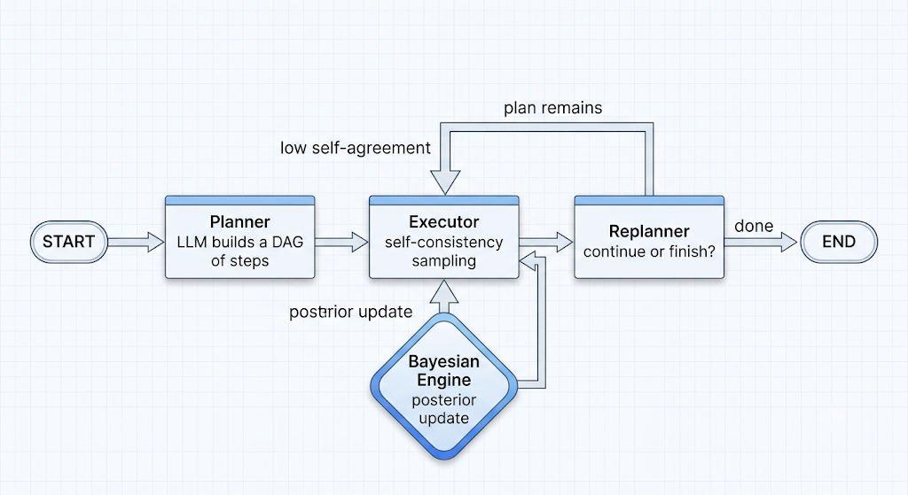
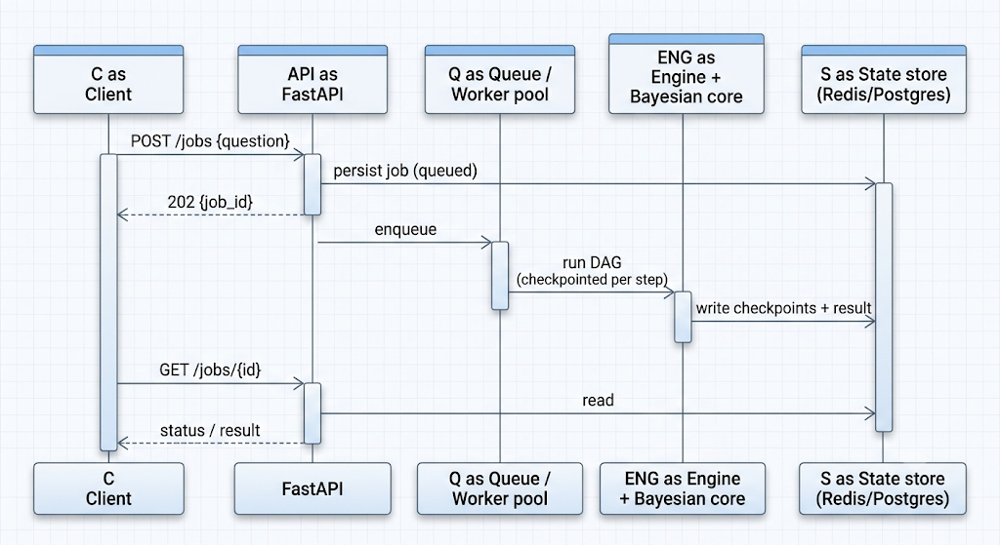

# Bayes Execution Engine

A **Plan-and-Execute** agent (LangGraph) with a **conjugate Bayesian conflict resolver**,
served behind an **async API**, running entirely on a **local LLM** via
[llama.cpp](https://github.com/ggml-org/llama.cpp).

Standard agents "guess again" on conflicting data and loop or hallucinate. This engine
decouples *planning* from *doing*, and gates each step's confidence on a **real Bayesian
update** driven by how consistently the model answers.

Whether that confidence is actually *calibrated* is a falsifiable claim, so the repo ships
the harness that tests it and reports what it found: on 500 TriviaQA + GSM8K items the
confidence is well calibrated (ECE 0.163, less than half either baseline) and, on factual
recall, genuinely discriminative — **abstaining on the least-confident half lifts accuracy
from 0.42 to 0.61**. It also reports where the signal fails. See
**[Calibration](#calibration-measuring-the-confidence-claim)**.

---

## Architecture

A LangGraph `StateGraph`: a shared `PlanExecuteState` flows Planner → Executor →
Replanner; the executor calls the Bayesian engine when a step is uncertain.



For long-running prompts an async API decouples the work so HTTP requests never time out
(`POST /jobs` → poll `GET /jobs/{id}`). In-repo that's a `ThreadPoolExecutor`; the same
contract maps to a Kafka/RabbitMQ + Celery deployment — see
[docs/SYSTEM_DESIGN.md](docs/SYSTEM_DESIGN.md).



---

## Execution model: self-consistency → real evidence

The executor runs each step by **sampling the model N times** (temp > 0) and measuring how
much the samples agree (self-consistency, Wang et al. 2022). From that it derives three
ordinal signals — `DataQuality` (agreement), `TaskStatus` (answerability), `ToolReliability`
(answer dispersion) — and feeds them to the Bayesian engine. The medoid (consensus) answer
flows on; the agreement drives confidence. So conflicts fire on **genuine model
uncertainty**, not keywords.

**One evidence path.** With no model the executor swaps in a deterministic *mock tool* that
sometimes returns conflicting readings — but its samples are measured exactly like a live
model's, so the offline suite exercises the real machinery. The older keyword extractor
(`core/signals.py`) is no longer on the agent path; it survives as an explicit opt-in
(`EXECUTOR_EVIDENCE=keywords`) for deployments with no sampling budget. Detail:
[docs/EXECUTION_MODEL.md](docs/EXECUTION_MODEL.md).

```bash
python demo.py --sim     # no model needed; shows the mechanism
```
```
CONFIDENT  "capital of France?"           self-consistency 1.00  CONFIDENCE 0.72  (CERTAIN)
AMBIGUOUS  "Bitcoin price next Tuesday?"  self-consistency 0.15  CONFIDENCE 0.34  (conflict)
```

---

## What you can ask it

Answers come from the **local model's own knowledge** (no web, no private data). Best fits:
explanations, comparisons, and decomposable multi-step reasoning (e.g. *"Explain how RSA
works and why it's secure"*). The point to demo is the **confidence contrast**: solid topics
score high; obscure/ambiguous ones scatter and confidence drops. Poor fits (by design):
real-time info, private data, hard trivia/math — self-consistency correctly reports low
confidence there.

---

## The Bayesian core

For each of the `5×5×5 = 125` signal contexts, `P(Outcome | context)` is **Categorical**;
its conjugate prior is the **Dirichlet** — that's the whole reason it's the right tool:

- **Conjugacy** ⇒ posterior in closed form, `α_post = α_prior + counts`. O(1) online updates,
  reproducible, no sampling.
- Lives on the **simplex** ⇒ every predictive column is a valid distribution by construction.
- `α₀ = Σα` **is** the effective sample size ⇒ free **credible intervals** that shrink with data.

```python
resolve_conflict({"TaskStatus": 4, "DataQuality": 4, "ToolReliability": 4})
# {"state": "AMBIGUOUS",
#  "confidence": 0.43, "credible_interval": [0.18, 0.69],          # P(MAP state)
#  "good_confidence": 0.16, "good_credible_interval": [0.02, 0.39], # P(CERTAIN)+P(HIGH)
#  "effective_sample_size": 13.0, ...}
```

Two pairs, deliberately distinct: the executor gates on `good_confidence`, so that is the one
with `good_credible_interval` around it. Pairing a confidence with the other interval attaches
a band to a quantity it doesn't describe — it need not even contain the number.

**Why 125?** Not "optimal" — it's `5³` (three signals × five ordinal levels), a granularity
choice: too coarse can't separate "uncertain" from "contradictory"; too fine leaves each
cell unvisited (curse of dimensionality). Richer input is handled by reducing dimensions,
not growing the table. Full derivation: [docs/BAYESIAN_DESIGN.md](docs/BAYESIAN_DESIGN.md).

---

## Calibration: measuring the confidence claim

A confidence number is only worth the evidence behind it, so `eval/` runs the **real
execution path** over questions with gold answers and logs one row per item — the evidence
triple, the continuous signals behind it, engine confidence, credible interval, ESS, the
medoid answer, and correctness. From those rows it produces a reliability diagram and ECE,
Brier with a bootstrap CI, AUROC of confidence as a correctness detector, and a
risk-coverage curve (*abstain on the least-confident 20%, keep this much accuracy*).

```bash
pip install -r requirements.txt -r requirements-eval.txt
llama-server -m ./models/Qwen2.5-7B-Instruct-Q4_K_M.gguf --port 8080

python -m eval.run_eval --model llama --dataset hf:triviaqa+hf:gsm8k --limit 250
python -m eval.run_eval --model sim  --dataset bundled      # offline, no model needed
```

Two baselines the Dirichlet layer has to beat, compared by **paired bootstrap** on the same
items: raw self-consistency agreement on its own, and mean token logprob. If the 125-cell
table doesn't beat plain agreement, that is a result too, and the report says so in those
words — `test_verdict_calls_out_a_losing_engine` pins that behaviour.

### Results

500 items (250 TriviaQA + 250 GSM8K), 4 samples each, `qwen2.5:3b-instruct` served locally.
Full report: **[eval/results/REPORT.md](eval/results/REPORT.md)**.

| Confidence signal | ECE ↓ | Brier ↓ | AUROC ↑ |
|---|---|---|---|
| **Bayesian engine (125-cell Dirichlet)** | **0.163** | **0.239** [0.226, 0.254] | 0.629 [0.576, 0.679] |
| Baseline: self-consistency agreement | 0.402 | 0.393 [0.360, 0.425] | 0.643 [0.590, 0.694] |
| Baseline: mean token logprob | 0.454 | 0.412 [0.382, 0.441] | **0.690** [0.641, 0.740] |

Read honestly, that is a **split decision**, and the split is the interesting part:

- **The Dirichlet layer buys calibration.** It more than halves ECE against both baselines,
  which is what you'd expect — it emits an actual posterior probability, while agreement and
  `exp(mean logprob)` are raw scores that were never on the probability scale.
- **It does not buy discrimination.** On AUROC it is not measurably better than plain
  agreement (−0.014 [−0.045, 0.018], CI straddles 0) and is *worse* than mean token logprob
  (−0.060 [−0.094, −0.028], CI excludes 0). The 125 cells are not adding ranking power over
  the raw signal.

### The signal works in one regime and not the other

| Dataset | Items | Accuracy | ECE ↓ | AUROC ↑ | Acc @100% | Acc @50% |
|---|---|---|---|---|---|---|
| TriviaQA | 250 | 0.424 | **0.089** | **0.722** [0.654, 0.784] | 0.424 | **0.608** |
| GSM8K | 250 | 0.220 | 0.278 | 0.529 [0.443, 0.615] | 0.220 | 0.224 |

On factual recall the confidence is both well calibrated and genuinely discriminative:
**abstain on the least-confident half and accuracy goes from 0.42 to 0.61.** On arithmetic the
AUROC confidence interval straddles 0.5 — the signal is indistinguishable from chance.

That is not a bug, it is self-consistency's known failure mode made concrete: agreement
measures whether the model *repeats itself*, not whether it is *right*. A wrong arithmetic
method reproduces the same wrong answer on all four samples and looks maximally confident.
Averaging the two datasets into one AUROC would have reported mediocre discrimination
everywhere and hidden this entirely.

`eval/results/example-simulated/` additionally shows the output format for a synthetic
answerer that is *told the gold answer*; it is banner-stamped `SIMULATED (not a result)` and
exists only to prove the pipeline runs with no model.

### Closing the loop

`engine.observe()` is now actually called. `eval/learning.py` splits the logged rows
train/test, feeds the train half back through the conjugate update, and scores prior-only
against posterior on **held-out** data. Observing helps, and the improvement clears its
confidence interval:

| Engine | ECE ↓ | Brier ↓ | AUROC ↑ |
|---|---|---|---|
| Prior only (as shipped) | 0.162 | 0.247 [0.228, 0.266] | 0.594 [0.522, 0.667] |
| Posterior (250 observations) | **0.107** | **0.225** [0.202, 0.248] | 0.613 [0.542, 0.685] |

ECE change from observing: **−0.055 [−0.107, 0.012]** on held-out items. The point estimate
improves and the learning curve falls monotonically for most of its length, but **the interval
straddles zero — at 250 held-out items this run does not establish the gain statistically.**
Treat it as suggestive, not demonstrated; the honest fix is more items, not a rephrasing.
Discrimination is unchanged within noise either way, which fits the split decision above:
counts tell the model *how often a context is right*, not how to rank contexts it already
separates.

And the credible intervals do what conjugacy says they should, measured rather than asserted:

| Mean ESS (α₀) | 14.4 | 20.7 | 30.0 | 39.0 | 51.5 |
|---|---|---|---|---|---|
| **Mean 95% CI width** | 0.438 | 0.383 | 0.308 | 0.305 | 0.243 |

**Context coverage: 42 of 125 cells** were ever visited across 500 items (34%); only 12 saw
10+ observations. Unvisited cells sit at their prior forever, so that is the honest empirical
argument for reducing dimensionality rather than growing the table. Running the same rows
through `scaling/latent_bayes.py` — six continuous signals → PCA → quantile bins, which are
populated by construction — reaches **64 of 125** cells and a better held-out ECE
(0.072 vs 0.107) at comparable AUROC.

Full method, metric definitions and limitations: **[docs/CALIBRATION.md](docs/CALIBRATION.md)**.

---

## Scaling to 10,000+ states

Discretising 8 raw signals into 5 bins is `5⁸ = 390,625` contexts — unpopulatable. Strategy:
**reduce, then reason** (`scaling/latent_bayes.py`): standardise → PCA to a few latent axes →
quantile-bin into a small dense grid → run the same conjugate update. `python
scaling/latent_bayes.py`:

| Naive states | Latent states | Compression | Variance kept | Accuracy | Baseline |
|---|---|---|---|---|---|
| 390,625 | 125 | 3,125× | 0.89 | 0.64 | 0.22 |

The table above is a synthetic demo of the mechanism. The same pipeline is now also fitted
on **real eval rows** (the executor's six continuous signals) and scored against the
hand-designed 125-cell grid on identical held-out items — see the coverage section of the
calibration report. Detail: [docs/SCALING.md](docs/SCALING.md).

---

## Running it

Full walkthrough with expected outputs in **[QUICKSTART.md](QUICKSTART.md)**. Local only —
`ChatOpenAI` just talks to `llama-server`'s OpenAI-compatible endpoint; nothing leaves the box.

```bash
llama-server -m ./models/Qwen2.5-7B-Instruct-Q4_K_M.gguf --port 8080  
pip install -r requirements.txt                                        
python main.py "Compare REST and gRPC and when to use each."           
python app.py                                                         
uvicorn service.api:app --port 8000                                  
```

Or `docker compose up` (engine + model server). Config via env vars (`.env`):
`LLAMA_CPP_BASE_URL`, `EXECUTOR_SAMPLES`, `JOB_STORE`, `CHECKPOINTER`, `LOG_LEVEL`.

---

## System design, observability, CI

- **Async + stateless** — submit/poll API; swap the worker pool for a broker unchanged.
- **Persistence / fault tolerance** — pluggable LangGraph checkpointer (Redis/Postgres) +
  job store; per-session `thread_id` gives multi-tenant isolation and horizontal scaling.
- **Observability** — `core/telemetry.py` emits structured JSON (and optional OpenTelemetry);
  each conflict logs confidence, credible interval, ESS, and the evidence coordinates.
- **CI/CD** — `Dockerfile` (model runs as a separate container) + GitHub Actions: ruff +
  `pytest` on a 3.10/3.11/3.12 matrix + image build.

Detail: [docs/SYSTEM_DESIGN.md](docs/SYSTEM_DESIGN.md).

---

## Testing

**119 unit tests** (conjugate updates, prior monotonicity, self-consistency, evidence-path
routing, calibration metrics, grading, the learning loop, JSON parsing, DAG routing, scaling,
job store). Run `pytest`. The Bayesian core is deterministic and the eval has an offline
answerer, so the whole suite — including the full calibration pipeline end to end — runs with
no model and no network.

---

## Roadmap

- ~~**Calibration eval** — reliability diagrams / ECE to prove confidences are calibrated.~~
  Built: `eval/`, [docs/CALIBRATION.md](docs/CALIBRATION.md). Headline numbers pending a run
  against a live model.
- ~~**Online CPT learning** — feed `(evidence, outcome)` back via `engine.observe`.~~ Built:
  `eval/learning.py` fits the posterior on a train split and scores it held-out.
- **Beat chance on arithmetic** — the measured GSM8K AUROC is 0.529 (CI straddles 0.5).
  Agreement can't separate "consistently right" from "consistently wrong", so this needs a
  signal that isn't self-agreement: verifier sampling, or execution of the derived arithmetic.
- **Semantic agreement** — swap bag-of-words cosine for embeddings/NLI (interface ready).
  Now measurable: re-run `eval/` and compare, rather than asserting it helped.
- **Confidence-driven control** — use the credible interval to re-plan / escalate / ask.
- **Real tools behind the executor** — typed tools/MCP; drive conflict from multi-source
  disagreement.
- **Broker-backed scaling** — Kafka/RabbitMQ + Celery + shared checkpointer.

---

## Repository layout

```
bayesian_engine/bayes_engine.py   Dirichlet–Multinomial conjugate engine
eval/                             calibration harness: metrics, learning loop, report
core/signals.py | json_utils.py   legacy keyword evidence (opt-in) | tolerant JSON parsing
core/graph.py | llm.py | telemetry.py   LangGraph wiring | llama.cpp client | logging
nodes/llm_executor.py             self-consistency execution + evidence
nodes/                            planner / executor / replanner
scaling/latent_bayes.py           PCA latent-space scaling PoC
service/api.py | persistence/     async API | job store + checkpointer
demo.py                           confident vs ambiguous confidence demo
tests/ (119) | docs/              pytest suite | design deep-dives
```
