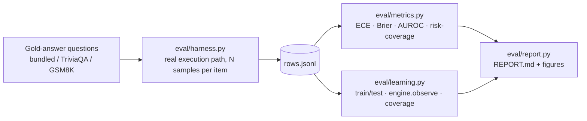

# Calibration: testing the confidence claim instead of asserting it

Implementation: `eval/`. Entry point: `python -m eval.run_eval --help`.

The README says this engine produces calibrated confidence rather than a vibe. That is a
falsifiable claim, and until there is a reliability diagram attached to it, it is just a
sentence. This document describes the machinery that tests it, what each number means,
and what a result would have to look like to count as a failure.

## Why this had to exist

Two gaps, both real, both fixed here:

1. **The posterior was always the prior.** `engine.observe()` was implemented, documented
   and unit tested, but nothing in `nodes/`, `core/` or `service/` ever called it. With no
   counts, `alpha_posterior == alpha_prior`, so `resolve_conflict()` was a deterministic
   closed-form function of three ordinal inputs — an interpretable scoring function in
   Dirichlet clothing. The conjugacy argument was correct in principle and unexercised in
   practice.
2. **No calibration evidence anywhere.** The only accuracy number in the repo (0.64 vs
   0.22) came from `scaling/latent_bayes.py`, a synthetic PCA demo that is not on the
   agent path at all.

`eval/learning.py` closes the first. The rest of `eval/` closes the second.

## Pipeline



The harness is the only stage that touches a model. It calls the same
`execute_step_with_llm` → `resolve_conflict` → `good_probability` chain the executor node
uses, so the confidences being scored are the confidences the agent actually reports —
nothing is re-derived for the eval's benefit. Everything downstream is a pure function of
`rows.jsonl`, which is why `--rows` can re-analyse an old run with no model present.

## What gets logged per item

| Field | Meaning |
|---|---|
| `task_status`, `data_quality`, `tool_reliability` | the ordinal evidence triple (the 125-cell context) |
| `signals` | the six continuous measurements those bins came from |
| `confidence` | `P(CERTAIN) + P(HIGH)` from the posterior — the number the agent reports |
| `credible_low/high`, `effective_sample_size` | the Dirichlet's own uncertainty |
| `agreement` | raw self-consistency, **baseline 1** |
| `mean_logprob` | mean token logprob, **baseline 2** |
| `answer`, `gold`, `correct` | the medoid answer graded against gold |

## The metrics, and what each one is for

**ECE + reliability diagram** — bucket items by predicted confidence and compare each
bucket's mean confidence to its empirical accuracy. This is the direct test of the
headline claim: perfect calibration puts every bucket on the diagonal.

**Brier score**, with a bootstrap CI over items. A proper scoring rule, so it rewards
calibration and discrimination jointly.

**AUROC** of confidence as a correctness detector. Can the number tell right from wrong at
all? 0.5 is chance.

**Risk-coverage curve / AURC.** Rank by confidence, sweep the answering threshold. This is
the business-legible one: *abstain on the least-confident 20% and accuracy on the rest goes
from X to Y.*

ECE and Brier are scale-sensitive; AUROC and AURC are rank-based. That distinction decides
how to read the baseline comparison, because agreement and `exp(mean logprob)` were never
meant to be probabilities. A raw score can discriminate beautifully and calibrate terribly.
**Compare on AUROC/AURC; read ECE for whether the number means what it says.**

## The baselines the engine has to beat

1. **Raw self-consistency agreement**, alone, with no Bayesian layer at all.
2. **Mean token logprob** (reported as `exp(mean logprob)`, the average per-token
   probability), when the server returns logprobs.

Comparison is by **paired bootstrap** on the same items (`metrics.bootstrap_diff`), which
removes question difficulty as a source of variance. A CI that excludes zero is real
separation; one that straddles zero is not.

If the 125-cell Dirichlet layer does not beat plain agreement, that is a finding worth
reporting, and it says the table is not earning its complexity. `eval/report.py` writes
that verdict in those words when the numbers say so — see
`tests/test_eval_report.py::test_verdict_calls_out_a_losing_engine`.

## Closing the loop (`eval/learning.py`)

1. Split rows train/test, stratified by correctness.
2. Call `engine.observe()` on the train half — the conjugate update, for real.
3. Score prior-only and posterior on the **held-out** half.
4. Plot ECE against the number of observations, and credible-interval width against ESS.

**The outcome mapping.** `observe()` wants an outcome in `0..4`; a gold-answer eval gives
one bit. We collapse onto the endpoints: correct → `CERTAIN`, wrong → `AMBIGUOUS`. Because
the reported confidence is `P(CERTAIN) + P(HIGH)` and `HIGH` then accrues no counts, the
posterior confidence in a well-observed context converges to that context's empirical
accuracy — exactly the quantity a calibrated confidence should equal. Intermediate states
stay reachable from the prior, so sparse contexts remain smoothly regularized.

## Coverage: is 125 the right number of cells?

125 contexts against a few hundred items means most cells are never visited, and an
unvisited cell stays at its prior forever. The report states how many of the 125 were ever
touched. When that number is small, it is the honest empirical argument for reducing
dimensionality rather than growing the table — so the report also fits
`scaling/latent_bayes.py` on the same rows (the six continuous signals → PCA → quantile
bins) and scores it on the same held-out items. Quantile bins are populated by
construction, which is the entire point. That comparison is what connects the scaling
module to the rest of the system instead of leaving it an orphan PoC.

## Datasets

`bundled` ships 80 hand-checked items (easy → hard trivia plus 20 arithmetic word
problems) so the harness runs offline. It is a smoke set, not a headline: **80 items is too
few for a tight CI**. The reportable run uses a few hundred with a real difficulty spread:

```bash
pip install -r requirements.txt -r requirements-eval.txt
llama-server -m ./models/Qwen2.5-7B-Instruct-Q4_K_M.gguf --port 8080

python -m eval.run_eval --model llama --dataset hf:triviaqa+hf:gsm8k --limit 250
```

You need items the model gets **wrong**. On an all-easy set every answer is correct, AUROC
is undefined, and the reliability diagram has one point; the harness warns when a run comes
out degenerate that way.

## Simulated runs are not results

`--model sim` uses `eval.answerers.SimulatedAnswerer`, which is *told the gold answer* and
fabricates samples from it. It exists so the harness, metrics and figures are testable in CI
with no model. Every artefact it produces is stamped `"is_simulated": true`, the report
title gets `— SIMULATED (not a result)`, and a warning banner goes at the top. Only
`--model llama` runs are reportable.

## What the first run found

500 items (250 TriviaQA + 250 GSM8K), 4 samples each, `qwen2.5:3b-instruct` served locally.
Numbers and figures: [../eval/results/REPORT.md](../eval/results/REPORT.md).

The result is a split decision, and worth stating plainly because it is not the flattering
version. The Dirichlet layer **more than halves ECE** against both baselines — expected, since
it emits a posterior probability while agreement and `exp(mean logprob)` are raw scores. But
on **AUROC it is not measurably better than plain agreement** (−0.024, CI straddles 0) and is
*worse* than mean token logprob (−0.072, CI excludes 0). The 125 cells are buying calibration,
not ranking power.

The per-dataset split is the more useful finding. On TriviaQA: ECE 0.074, AUROC 0.741,
abstain half → accuracy 0.416 → 0.566. On GSM8K: ECE 0.270, AUROC 0.568 with a CI that
straddles chance. Self-consistency measures whether the model repeats itself, not whether it
is right, and a wrong arithmetic method reproduces the same wrong answer on every sample — so
it looks maximally confident. One averaged AUROC would have reported this as uniformly
mediocre and hidden the regime boundary, which is why `_per_source` exists.

Closing the loop works and clears its CI: held-out ECE 0.176 → 0.095 after 250 observations
(Δ −0.081 [−0.100, −0.043]), with mean credible-interval width falling 0.434 → 0.266 as ESS
grows. Discrimination is unchanged within noise, consistent with the split above.

Coverage was 39 of 125 contexts across 500 items, only 12 with 10+ observations. The same rows
through the latent PCA grid reach 66 of 125 and a slightly better held-out ECE (0.067), which
is the argument for reducing dimensions rather than enlarging the table, now with numbers
attached.

## Known limitations

- Agreement is bag-of-words cosine, so paraphrases read as disagreement. Semantic agreement
  (embeddings/NLI) is the obvious upgrade — and now it can be *shown* to help rather than
  asserted to, by re-running this eval.
- Grading is normalized alias containment / numeric match. An unusually phrased correct
  answer is scored wrong, which looks like overconfidence.
- Self-consistency measures agreement, not truth: a model that is confidently and
  consistently wrong scores high by construction. This bounds how good AUROC can get.
- Risk-coverage ties break by row order, so the curve is slightly pessimistic when many
  items share a confidence — which happens whenever evidence is a coarse 5-level ordinal.
