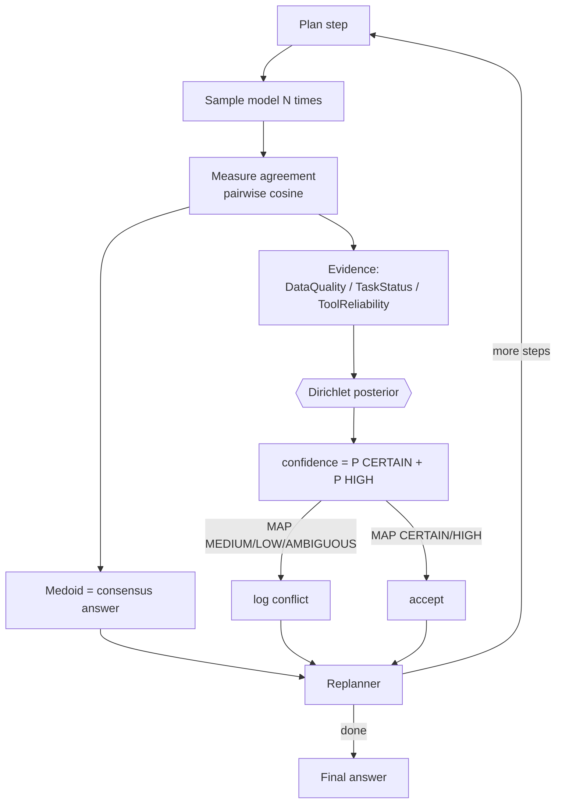

# Execution Model: Self-Consistency as a Confidence Signal

Implementation: `nodes/llm_executor.py` + `nodes/executor.py`.

A naive agent runs a step once and trusts it, leaving the Bayesian resolver nothing real to
act on. Instead, the executor runs each step **N times at temperature > 0** and measures how
much the samples agree. Sample disagreement is a well-supported proxy for model uncertainty
(self-consistency, Wang et al. 2022).

## The three signals (real measurements, not keywords)

| Signal | Measured from | Maps to |
|---|---|---|
| `DataQuality` | mean pairwise agreement of samples | low agreement ⇒ degraded |
| `TaskStatus` | fraction of non-refusal/non-empty samples | refusals ⇒ degraded |
| `ToolReliability` | distinct answers / N | high dispersion ⇒ unstable |

Each maps onto `0 = CERTAIN … 4 = AMBIGUOUS`, e.g. `DataQuality = clip(round((1−agreement)×4))`.
Agreement is dependency-free bag-of-words cosine (swap in embeddings without other changes).
The **medoid** — the sample most similar to all others — is the consensus answer returned.

## Confidence

The three signals feed `resolve_conflict`, which returns a posterior over outcome quality
plus a credible interval. The step's scalar confidence is `P(CERTAIN) + P(HIGH)`. When the
MAP outcome is MEDIUM/LOW/AMBIGUOUS the step is logged as `bayes.conflict_resolved`, and the
replanner can re-plan or surface the low confidence.

This is the distinctive bit: the system **quantifies its own uncertainty from the model's
behaviour** and gates confidence on a principled fusion of three signals.

## Config & fallback

| Env | Default | Meaning |
|---|---|---|
| `EXECUTOR_SAMPLES` | 4 | samples per step (1 disables self-consistency) |
| `EXECUTOR_TEMPERATURE` | 0.7 | sampling temperature |

With no model (tests/offline) the executor uses a deterministic keyword mock, keeping the
suite reproducible.

## Limitations

Lexical agreement can miss paraphrases (embeddings fix this); N samples cost N× tokens; and
self-consistency measures *internal* consistency, not factual truth — a confidence signal,
not an oracle.
