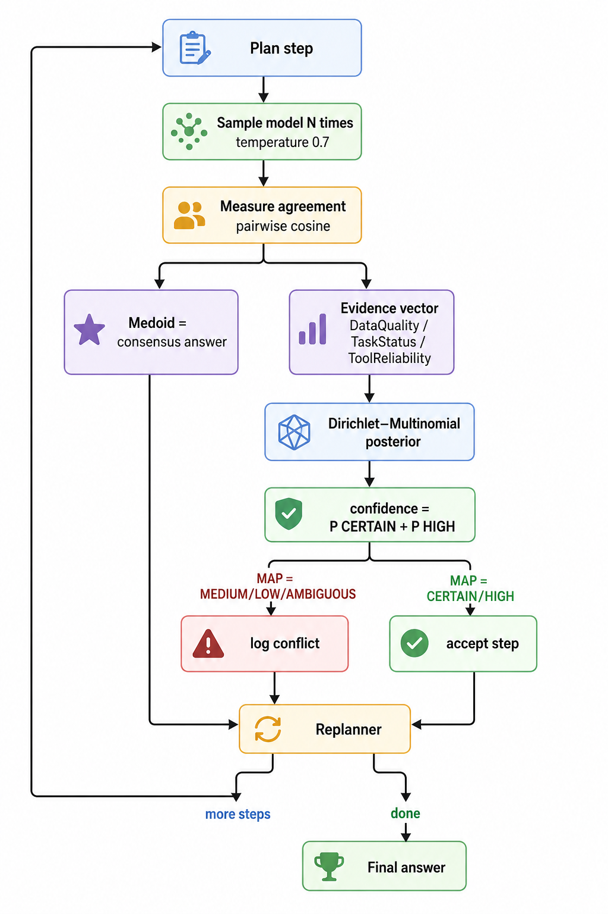

# Execution Model: Self-Consistency as a Confidence Signal

This document explains how a plan step is executed and, crucially, how the engine turns
the model's own behaviour into a *real* uncertainty signal that the Bayesian conflict
resolver can act on. Implementation: `nodes/llm_executor.py` + `nodes/executor.py`.

## The problem it solves

A naive agent executes a step once and trusts the answer. That gives the Bayesian
conflict resolver nothing real to reason about — you'd have to invent a "conflict" from
keywords, which is exactly the hollow design this project set out to fix. We need a
*measured* signal of how reliable each step's output actually is.

## Self-consistency

Instead of one call, the executor runs each step **N times at temperature > 0** and
measures how much the samples agree. Agreement among a model's own samples is a
well-supported proxy for confidence: when a model knows something, repeated samples
converge; when it's hallucinating or guessing, they scatter (self-consistency,
Wang et al., 2022).

```
step ──▶ sample × N (temp > 0) ──▶ measure agreement ──▶ {consensus answer, evidence}
```

### The loop



High agreement → tight posterior on CERTAIN/HIGH → high confidence, step accepted.
Scattered samples → posterior mass on LOW/AMBIGUOUS → conflict logged, and the replanner
can react (re-plan, gather more, or surface the low confidence).

### Turning samples into the three ordinal signals

We do **not** invent evidence. Each of the engine's three signals is a real measurement
over the N samples (all derived in `execute_step_with_llm`):

| Signal | Measured from | Intuition |
|---|---|---|
| `DataQuality` | mean pairwise semantic agreement of the samples | low agreement ⇒ the model contradicts itself ⇒ degraded |
| `TaskStatus` | answerability: fraction of samples that aren't refusals/empties | the model declining ("I don't know") ⇒ degraded |
| `ToolReliability` | answer dispersion: number of distinct answers / N | many different answers ⇒ unstable signal |

Each maps onto the ordinal scale `0 = CERTAIN … 4 = AMBIGUOUS`, e.g.
`DataQuality = clip(round((1 − agreement) × 4))`.

### Agreement metric (dependency-free)

Agreement is the mean pairwise cosine similarity of bag-of-words vectors of the samples.
This keeps the project pure-Python + numpy (no embedding model, no extra service). The
interface is deliberately narrow, so swapping in sentence embeddings or an NLI model for
a semantic upgrade requires no change elsewhere.

### Consensus answer (medoid)

The answer returned to the replanner is the **medoid** — the sample with the highest
total similarity to all the others, i.e. the most representative output. This is the
self-consistency "majority vote" generalised to free-form text, and it discards outlier
samples (the hallucinated tangents).

## From evidence to a confidence score

The three measured signals are fed to the Dirichlet–Multinomial engine
(`resolve_conflict`), which returns a posterior distribution over outcome quality plus a
calibrated credible interval. The step's scalar confidence is the posterior probability
that the outcome is high-quality:

```
confidence = P(CERTAIN) + P(HIGH)
```

When the posterior's MAP outcome is `MEDIUM`/`LOW`/`AMBIGUOUS`, the step is logged as a
`bayes.conflict_resolved` event — a genuine, measured conflict, not a keyword match. The
replanner can then choose to re-plan, gather more evidence, or surface the low confidence
to the caller.

## Why this is the interesting part

It closes the loop the original project only gestured at: the system now **quantifies its
own uncertainty from the model's behaviour** and gates its confidence on it, using a
principled Bayesian fusion of three independent signals rather than a single heuristic.
That is a real, defensible reliability mechanism — "probabilistic confidence-gating of an
agent's own outputs" — and it is what distinguishes this from a stock plan-and-execute
agent.

## Configuration

| Env var | Default | Meaning |
|---|---|---|
| `EXECUTOR_SAMPLES` | `4` | samples drawn per step |
| `EXECUTOR_TEMPERATURE` | `0.7` | sampling temperature (diversity needed to measure agreement) |

## Fallback (no LLM)

If no `executor_model` is supplied (unit tests, offline runs), the executor uses a
deterministic keyword mock that simulates enterprise tools sometimes returning
conflicting data. This keeps the whole engine runnable and unit-testable without a live
model, and is why the test suite is fully deterministic.

## Honest limitations

- **Lexical agreement** can over-credit answers that share words but differ in meaning, or
  under-credit paraphrases. It is a strong, cheap baseline; semantic embeddings are the
  upgrade path and the interface already supports them.
- **Cost.** N samples per step is N× the tokens. `EXECUTOR_SAMPLES` trades reliability
  signal quality against latency/cost; 3–5 is a reasonable range.
- Self-consistency measures *internal* consistency, not factual correctness — a model can
  be consistently wrong. It is a confidence signal, not a truth oracle, and is presented
  as such (with credible intervals, never as certainty).
