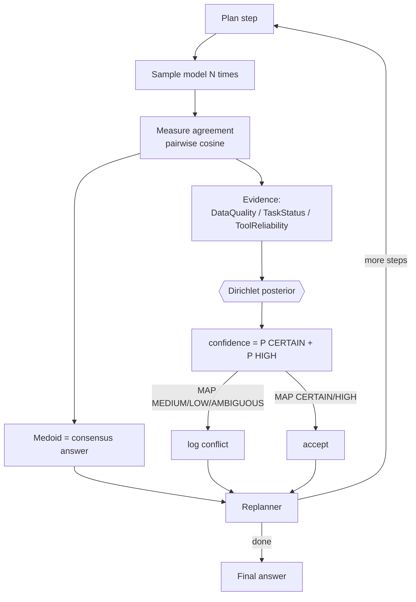

# Execution Model: Self-Consistency as a Confidence Signal

Implementation: `nodes/llm_executor.py` + `nodes/executor.py`.

A naive agent runs a step once and trusts it, leaving the Bayesian resolver nothing real to
act on. Instead, the executor runs each step **N times at temperature > 0** and measures how
much the samples agree. Sample disagreement is a well-supported proxy for model uncertainty
(self-consistency, Wang et al. 2022).

```mermaid
flowchart TD
    STEP[Plan step] --> SAMPLE[Sample model N times]
    SAMPLE --> AGREE[Measure agreement<br/>pairwise cosine]
    AGREE --> MEDOID[Medoid = consensus answer]
    AGREE --> EVID[Evidence:<br/>DataQuality / TaskStatus / ToolReliability]
    EVID --> BAYES{{Dirichlet posterior}}
    BAYES --> CONF[confidence = P CERTAIN + P HIGH]
    CONF -->|MAP MEDIUM/LOW/AMBIGUOUS| CONFLICT[log conflict]
    CONF -->|MAP CERTAIN/HIGH| ACCEPT[accept]
    MEDOID --> REPLAN[Replanner]
    CONFLICT --> REPLAN
    ACCEPT --> REPLAN
    REPLAN -->|more steps| STEP
    REPLAN -->|done| FINAL[Final answer]
```

## The three signals (real measurements, not keywords)

| Signal | Measured from | Maps to |
|---|---|---|
| `DataQuality` | mean pairwise agreement of samples | low agreement ⇒ degraded |
| `TaskStatus` | fraction of non-refusal/non-empty samples | refusals ⇒ degraded |
| `ToolReliability` | distinct answers / N | high dispersion ⇒ unstable |

Each maps onto `0 = CERTAIN … 4 = AMBIGUOUS`, e.g. `DataQuality = clip(round((1−agreement)×4))`.
Agreement is dependency-free bag-of-words cosine (swap in embeddings without other changes).
The **medoid** — the sample most similar to all others — is the consensus answer returned.

## Confidence

The three signals feed `resolve_conflict`, which returns a posterior over outcome quality
plus a credible interval. The step's scalar confidence is `P(CERTAIN) + P(HIGH)`. When the
MAP outcome is MEDIUM/LOW/AMBIGUOUS the step is logged as `bayes.conflict_resolved`, and the
replanner can re-plan or surface the low confidence.

This is the distinctive bit: the system **quantifies its own uncertainty from the model's
behaviour** and gates confidence on a principled fusion of three signals.

## Config & fallback

| Env | Default | Meaning |
|---|---|---|
| `EXECUTOR_SAMPLES` | 4 | samples per step (1 disables self-consistency) |
| `EXECUTOR_TEMPERATURE` | 0.7 | sampling temperature |
| `EXECUTOR_EVIDENCE` | `self-consistency` | `keywords` opts into the legacy extractor |

**One evidence path.** With no model the executor swaps the backend, not the measurement:
`_MockToolSampler` is a deterministic *fake tool* whose scripted readings sometimes
disagree, and those samples go through the same agreement computation a live model's would.
So the offline suite exercises the real machinery and stays reproducible.

The repo used to derive offline evidence by keyword-matching the result text, which
contradicted the claim above — two notions of "evidence", only one of them measured. That
extractor now lives in `core/signals.py` as an explicit opt-in
(`EXECUTOR_EVIDENCE=keywords`) for deployments with no sampling budget, where a single-shot
tool returns text and there is no disagreement to measure. It is never the default, and
`tests/test_e2e.py::test_executor_evidence_defaults_to_self_consistency` fails if it ever
becomes one.

## Does any of this actually work?

Self-consistency is a *proxy* for correctness, not a proof of it, so the claim is tested
rather than asserted: `eval/` scores these confidences against gold answers with reliability
diagrams, ECE, AUROC and risk-coverage, against baselines including raw agreement with no
Bayesian layer at all. See [CALIBRATION.md](CALIBRATION.md).

## Limitations

Lexical agreement can miss paraphrases (embeddings fix this); N samples cost N× tokens; and
self-consistency measures *internal* consistency, not factual truth, which is a confidence signal,
not an oracle.
