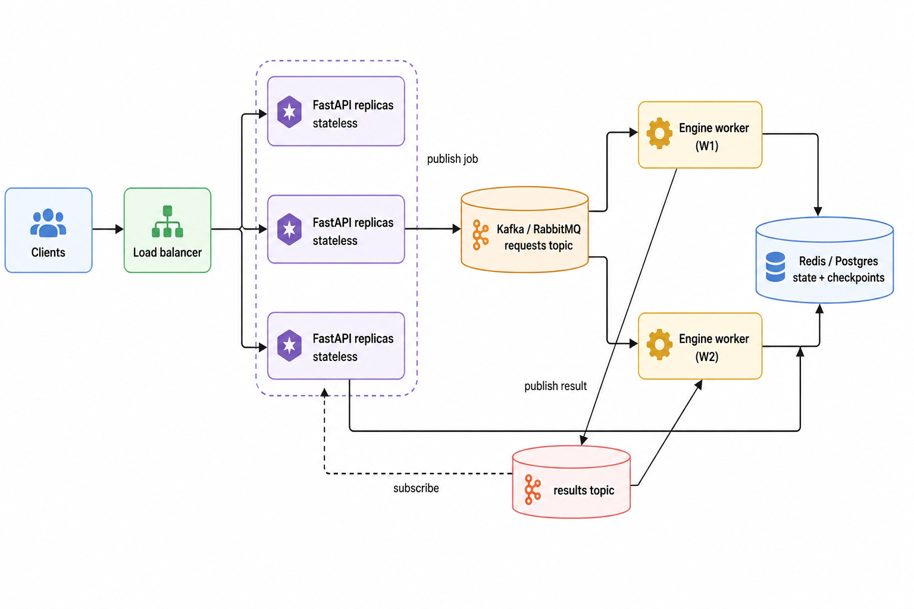

# System Design

**[implemented]** = in this repo; **[blueprint]** = documented design the code is shaped to accept.

## 1. Decoupled async execution **[implemented + blueprint]**

A run makes several LLM calls (tens of seconds), so it can't sit in a sync request. Contract
(`service/api.py`): `POST /jobs {question}` → `202 {job_id}` (instant) → poll `GET /jobs/{id}`.
In-repo the worker is a `ThreadPoolExecutor`; swap it for a broker + workers with the same
contract. `_run_job` is already the unit a Celery task would wrap.

## 2. Persistence & fault tolerance **[implemented]**

`persistence/checkpointer.py` persists `PlanExecuteState` after every node, keyed by `thread_id`
(`CHECKPOINTER=memory|redis|postgres`). This gives: **fault tolerance** (restart resumes
mid-DAG), **multi-tenancy** (each session = a `thread_id`, zero state bleed), and **horizontal
scaling** (shared saver ⇒ any worker resumes any thread). Job lifecycle is persisted via
`persistence/job_store.py` (`InMemoryJobStore` / `RedisJobStore`, selected by `JOB_STORE`).

## 3. Concurrency model **[implemented]**

| Concern | Mechanism |
|---|---|
| Per-user isolation | LangGraph `thread_id` |
| Job state across restarts | `RedisJobStore` |
| DAG progress across restarts | Redis/Postgres checkpointer |

External, keyed state ⇒ N workers serve M sessions with no shared mutable memory.

## 4. Observability **[implemented]**

`core/telemetry.py` emits structured JSON (+ optional OpenTelemetry): `engine.run` timing,
`bayes.conflict_resolved` (confidence, state, credible interval, ESS, evidence coords),
`job.*`. **Alerting [blueprint]:** page on rising low-confidence-resolution rate (degraded
data) or a tool's `ToolReliability` collapse (failing schema); track p95 latency and posterior
ESS.

## 5. CI/CD & containerisation **[implemented]**

`Dockerfile` (slim, non-root, healthcheck; GGUF weights run in a *separate* `llama-server`
container per `docker-compose.yml`). GitHub Actions: ruff → pytest (3.10/3.11/3.12) → image build.

## 6. Infrastructure as Code **[blueprint]**

Terraform would provision a container service (ECS/Cloud Run/AKS), managed Redis, optional
Postgres. The app is 12-factor (all config via env), so it drops in without code changes.

## 7. Cross-stack interop **[blueprint]**

The submit/poll API and broker contract are language-agnostic — a Java/Spring service
integrates over HTTP/JSON or the message topics, never via in-process calls.
