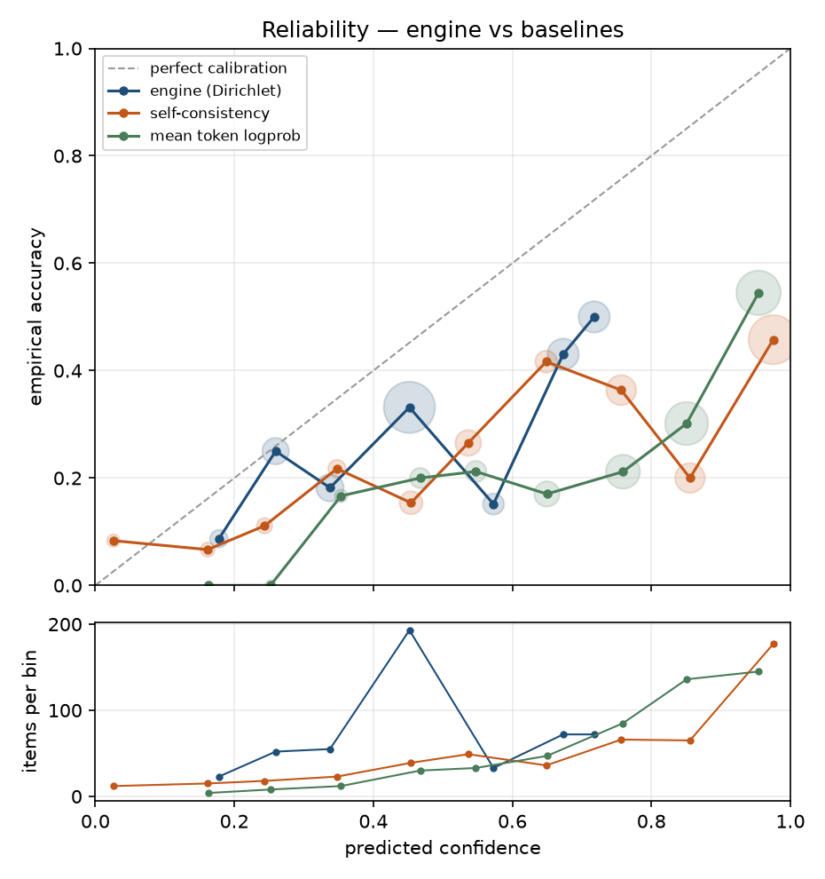
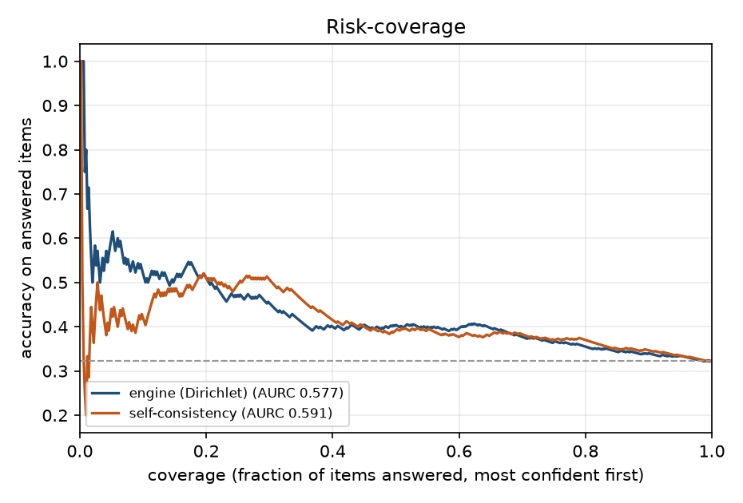
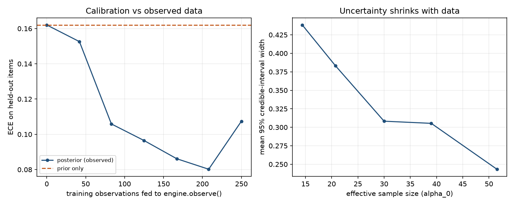

# Calibration report

## Provenance

| Field | Value |
|---|---|
| Generated (UTC) | 2026-09-16T02:18:00Z |
| Answerer | `local-openai-compatible` |
| Model | `qwen2.5:3b-instruct` |
| Simulated | no |
| Dataset spec | `hf:triviaqa+hf:gsm8k` |
| Items | 500 |
| Samples per item | 4 |

Composition: arithmetic × 250, mixed × 250.

## Fix 1 — is the confidence calibrated?

ECE and Brier are scale-sensitive, so a raw score never meant to be a probability can discriminate well and still calibrate badly. AUROC and AURC are rank-based and compare the engine and the baselines on equal terms — read those for *does the number know anything*, and ECE for *does the number mean what it says*. Brackets are 95% bootstrap CIs over items.

| Confidence signal | ECE ↓ | Brier ↓ | AUROC ↑ | AURC ↓ | Acc @100% | Acc @80% |
|---|---|---|---|---|---|---|
| Bayesian engine (125-cell Dirichlet) | 0.163 | 0.239 [0.226, 0.254] | 0.629 [0.576, 0.679] | 0.577 | 0.322 | 0.355 |
| Baseline: self-consistency agreement | 0.402 | 0.393 [0.360, 0.425] | 0.643 [0.590, 0.694] | 0.591 | 0.322 | 0.370 |
| Baseline: mean token logprob | 0.454 | 0.412 [0.382, 0.441] | 0.690 [0.641, 0.740] | 0.532 | 0.322 | 0.360 |

### Verdict

- Confidence separates correct from incorrect answers at AUROC 0.629.
- ECE is 0.163 over 10 bins; the engine is overconfident on average (mean confidence 0.485 vs accuracy 0.322).
- Abstaining on the least-confident 20% lifts accuracy on the remainder from 0.322 to 0.355.
- The engine is **not** measurably better than *Baseline: self-consistency agreement* on AUROC (-0.014 [-0.045, 0.018]; CI straddles 0). On this dataset the 125-cell layer is not adding discrimination over the raw signal.
- The engine is **worse** than *Baseline: mean token logprob* on AUROC by -0.060 [-0.094, -0.028] (CI excludes 0). The extra machinery is costing discrimination here.

### Reliability bins (engine)

| Confidence bin | Items | Mean confidence | Empirical accuracy | Gap |
|---|---|---|---|---|
| 0.1–0.2 | 23 | 0.178 | 0.087 | +0.091 |
| 0.2–0.3 | 52 | 0.259 | 0.250 | +0.009 |
| 0.3–0.4 | 55 | 0.338 | 0.182 | +0.156 |
| 0.4–0.5 | 193 | 0.452 | 0.332 | +0.120 |
| 0.5–0.6 | 33 | 0.573 | 0.152 | +0.421 |
| 0.6–0.7 | 72 | 0.673 | 0.431 | +0.243 |
| 0.7–0.8 | 72 | 0.718 | 0.500 | +0.218 |

### Per-dataset breakdown

One averaged number hides the most useful thing in this run: self-consistency has a known failure mode — a model that is *consistently* wrong looks confident — and arithmetic is where that bites, because a wrong method reproduces the same wrong answer every sample.

| Dataset | Items | Accuracy | ECE ↓ | AUROC ↑ | AUROC (agreement) | Acc @100% | Acc @50% |
|---|---|---|---|---|---|---|---|
| gsm8k | 250 | 0.220 | 0.278 | 0.529 [0.443, 0.615] | 0.563 | 0.220 | 0.224 |
| triviaqa | 250 | 0.424 | 0.089 | 0.722 [0.654, 0.784] | 0.718 | 0.424 | 0.608 |

## Fix 2 — closing the learning loop

`engine.observe()` was called on 250 training rows (250 observations); both engines are then scored on the same 250 **held-out** rows.

| Engine | ECE ↓ | Brier ↓ | AUROC ↑ | Acc @100% |
|---|---|---|---|---|
| Prior only (as shipped) | 0.162 | 0.247 [0.228, 0.266] | 0.594 [0.522, 0.667] | 0.324 |
| Posterior (observed) | 0.107 | 0.225 [0.202, 0.248] | 0.613 [0.542, 0.685] | 0.324 |

ECE change from observing (posterior − prior, negative is better): **-0.055 [-0.107, 0.012]**.

### Credible-interval width vs effective sample size

| ESS bucket | Mean ESS | Mean 95% CI width | Items |
|---|---|---|---|
| 13.0–18.0 | 14.4 | 0.438 | 43 |
| 18.0–30.0 | 20.7 | 0.383 | 55 |
| 30.0–39.0 | 30.0 | 0.308 | 51 |
| 39.0–51.0 | 39.0 | 0.305 | 29 |
| 51.0–52.0 | 51.5 | 0.243 | 72 |

### Learning curve (held-out)

| Train observations | ECE ↓ | AUROC ↑ | Mean CI width | Mean ESS |
|---|---|---|---|---|
| 0 | 0.162 | 0.594 | 0.484 | 13.0 |
| 42 | 0.153 | 0.616 | 0.441 | 16.5 |
| 83 | 0.106 | 0.601 | 0.401 | 20.2 |
| 125 | 0.096 | 0.626 | 0.379 | 23.0 |
| 167 | 0.086 | 0.619 | 0.360 | 26.2 |
| 208 | 0.080 | 0.623 | 0.342 | 29.3 |
| 250 | 0.107 | 0.613 | 0.328 | 32.5 |

## Context coverage — is a 125-cell table the right size?

Across all 500 evaluated items the engine visited **42 of 125** contexts (33.6%); 12 contexts saw 10+ observations, and the busiest held 77.

Cells never visited stay at their prior no matter how long the system runs, so low coverage is the empirical argument for reducing dimensionality rather than growing the table — which is what `scaling/latent_bayes.py` does.

### Same rows through the latent (PCA) grid

The executor's 6 continuous signals would give 15,625 naive contexts at 5 bins each. Projected to 125 quantile-binned latent cells, **64** were visited (explained variance 0.863).

| Model | ECE ↓ | Brier ↓ | AUROC ↑ | Contexts visited |
|---|---|---|---|---|
| Hand-designed 125-cell grid | 0.107 | 0.225 [0.202, 0.248] | 0.613 [0.542, 0.685] | 42/125 |
| Latent PCA grid | 0.072 | 0.224 [0.204, 0.246] | 0.582 [0.508, 0.655] | 64/125 |

## Figures

**Reliability diagram**



**Risk-coverage curve**



**Learning loop**



## How to reproduce

```bash
python -m eval.run_eval --model llama --dataset hf:triviaqa+hf:gsm8k --samples 4
```

## Limitations

- Agreement is bag-of-words cosine, so paraphrases read as disagreement and the confidence signal is pessimistic on verbose answers.
- Grading is normalized alias containment / numeric match: a correct answer phrased unusually can be scored wrong, which shows up as apparent overconfidence.
- Self-consistency measures agreement, not truth. A model that is confidently and consistently wrong scores high here by construction.
- Risk-coverage ties are broken by row order, so the curve is slightly pessimistic when many items share a confidence — which happens whenever the evidence is a coarse 5-level ordinal.

